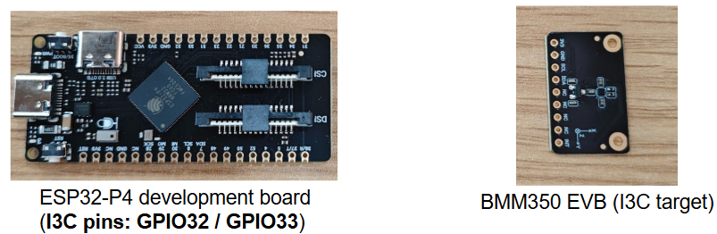

# Bosch BMM350 Magnetometer over I3C on ESP32-P4

## Overview

This repository is a **preliminary open-source attempt** to explore the feasibility of bringing up a **single Bosch BMM350 sensor** over **I3C** on **ESP32-P4**.

<!-- add a figure here -->


Since BMM350-over-I3C examples are still relatively limited, this project is shared as a lightweight reference in the hope that it may be useful to others working on similar hardware bring-up and debugging tasks.

The current focus is on:
- I3C bus initialization on ESP32-P4
- single-sensor BMM350 bring-up
- basic raw magnetic and temperature readout

At present, the repository includes **three single-sensor I3C examples**:
- **SETAASA** — reuse static address as dynamic address
- **SETDASA** — assign a new dynamic address using static address
- **ENTDAA** — automatically discover the device and assign a dynamic address

## Current Status

### Currently Covered
- ESP32-P4 I3C master bus initialization
- Single BMM350 I3C bring-up
  - `SETAASA` example
  - `SETDASA` example
  - `ENTDAA` example
- Raw burst magnetic / temperature readout

### Notes
- The current examples are based on the default static address configuration of BMM350 (`0x14`)
- In principle, the setup can be extendable to **two BMM350 sensors** if the two devices use different static addresses (`0x14` and `0x15`)

### Not Yet Supported
- Multi-sensor (i.e., more than two) BMM350 I3C on one shared bus
- Automatic multi-device identity handling

## Hardware

### Controller
- [DFRobot FireBeetle 2 ESP32-P4](https://www.dfrobot.com/product-2915.html)
- Additional chip-level details are available in the [ESP32-P4 datasheet](https://documentation.espressif.com/esp32-p4_datasheet_en.pdf)

### Target Sensor
- [DFRobot Fermion BMM350 EVB](https://www.dfrobot.com/product-2891.html?srsltid=AfmBOoowFYMnucgk2IW3rAIRciNX7AoznstBkSVFOusGm2l1H5nq4p6-)
- Additional sensor details are available in the [Bosch BMM350 datasheet](https://www.bosch-sensortec.com/media/boschsensortec/downloads/datasheets/bst-bmm350-ds001.pdf)

### Default Wiring
- `SDA` -> `GPIO33`
- `SCL` -> `GPIO32`
- `VCC` -> `3V3`
- `GND` -> `GND`

> The current examples assume the wiring above by default.  
> If your hardware uses different pins, please update the corresponding macros in the selected example source file.
---

## Software

- **Framework:** [ESP-IDF (latest)](https://github.com/espressif/esp-idf/tree/master)
- **Getting Started Reference:** <https://docs.espressif.com/projects/esp-idf/en/latest/esp32p4/get-started/index.html>
---

## Repository Structure

### Core Driver Files (`driver/`)
- **`bmm350_defs.h`** — register definitions and shared constants
- **`bmm350.h`** — public BMM350 driver interface
- **`bmm350.c`** — core BMM350 driver implementation

> These core driver files are adapted from the official [Bosch Sensortec BMM350 SensorAPI](https://github.com/boschsensortec/BMM350_SensorAPI).

### ESP32-P4 I3C Port Layer (`esp32_i3c_port/`)
- **`bmm350_port_esp32p4_i3c.h`** — ESP32-P4 I3C port-layer header
- **`bmm350_port_esp32p4_i3c.c`** — ESP32-P4 I3C port-layer implementation

### Example Entry Files (`examples/`)
- **`single_bmm350_i3c_setaasa_main.c`** — single-sensor `SETAASA` example
- **`single_bmm350_i3c_setdasa_main.c`** — single-sensor `SETDASA` example
- **`single_bmm350_i3c_entdaa_main.c`** — single-sensor `ENTDAA` example

### Build Files
- **`CMakeLists.txt`** — project build configuration

> To test a specific mode, replace the default `main.c` with the corresponding example entry file listed above.

---

## Quick Start

### 1. Set Up Your ESP-IDF Project

Make sure ESP-IDF is installed and exported correctly in your environment.
If needed, refer to the official [ESP32-P4 getting-started guide](https://docs.espressif.com/projects/esp-idf/en/latest/esp32p4/get-started/index.html)


For this project, it is recommended to install ESP-IDF using [ESP-IDF Installation Manager](https://docs.espressif.com/projects/idf-im-ui/en/latest/), and to select the **latest version** (i.e., the current `master` branch).
**Older ESP-IDF releases may not include full or stable I3C support for ESP32-P4.**


In a typical ESP-IDF project (for example, when using VS Code + ESP-IDF extension), the source files in this repository are expected to live under the project's `main/` component directory.

---

### 2. Choose an Example
Select one example and use it as the active entry file in your ESP-IDF project.

If your project expects a single `main.c`, you can either:
- rename the selected example as `main.c`, or
- keep the file name and include it explicitly in `main/CMakeLists.txt`

---

### 3. Build, Flash, and Monitor

Use the standard ESP-IDF workflow:

```bash
idf.py build
idf.py flash monitor
```

**Configuration note:**

The DFRobot FireBeetle 2 ESP32-P4 development board uses:
- **chip revision:** `v1.0`
- **CPU frequency:** `360 MHz`

Before building, please check the relevant settings in **ESP-IDF configuration** to ensure they match your board and environment.
For example, if you are using **VS Code + ESP-IDF extension**, you can open:
- **ESP-IDF: SDK Configuration Editor**

Then go to:
- **Component config** → **Hardware Settings** → **Chip revision**
  - select **ESP32-P4 revisions < 3.0 (No >=3.x Support)**


### 4. Expected Result

A successful run should show:
- I3C bus initialization success
- successful CHIP_ID probe (0x33)
- valid repeated sensor readout

Example Output (SETAASA)
```
I (288) main_task: Calling app_main()
I (288) BMM350_SETAASA_1X: Step 1: Init I3C bus
I (288) bmm350_i3c: BMM350 on I3C: static=0x14 dynamic=0x14 SDA=33 SCL=32 OD=400000 PP=2000000
I (298) BMM350_SETAASA_1X: Step 2: Send CCC SETAASA
I (298) BMM350_SETAASA_1X: I3C SETAASA cost = 187 us
I (308) BMM350_SETAASA_1X: Step 3: Raw I3C probe on dynamic address 0x14
I (308) BMM350_SETAASA_1X: Raw I3C CHIP_ID bytes: 00 00 33
I (318) BMM350_SETAASA_1X: I3C CHIP_ID probe cost = 5216 us
I (318) BMM350_SETAASA_1X: Raw CHIP_ID probe success
I (328) BMM350_SETAASA_1X: Step 4: Bind Bosch SensorAPI
I (328) BMM350_SETAASA_1X: Step 5: Minimal sensor initialization
I (388) BMM350_SETAASA_1X: Minimal init success
I (388) BMM350_SETAASA_1X: Step 6: Read magnetic field data
I (388) BMM350_SETAASA_1X: X=31.02 uT Y=-67.48 uT Z=24.75 uT | |B|=78.28 uT | Temp=22.58 C | read=181 us
I (398) BMM350_SETAASA_1X: X=30.99 uT Y=-67.64 uT Z=25.30 uT | |B|=78.59 uT | Temp=22.58 C | read=138 us
I (408) BMM350_SETAASA_1X: X=31.19 uT Y=-67.43 uT Z=25.75 uT | |B|=78.63 uT | Temp=22.59 C | read=138 us
I (418) BMM350_SETAASA_1X: X=31.28 uT Y=-67.29 uT Z=25.39 uT | |B|=78.42 uT | Temp=22.61 C | read=138 us
I (428) BMM350_SETAASA_1X: X=31.01 uT Y=-67.07 uT Z=25.77 uT | |B|=78.26 uT | Temp=22.59 C | read=138 us
I (438) BMM350_SETAASA_1X: X=31.18 uT Y=-67.03 uT Z=25.80 uT | |B|=78.30 uT | Temp=22.58 C | read=138 us
I (448) BMM350_SETAASA_1X: X=31.10 uT Y=-67.20 uT Z=25.03 uT | |B|=78.16 uT | Temp=22.58 C | read=138 us
I (458) BMM350_SETAASA_1X: X=31.45 uT Y=-67.16 uT Z=25.55 uT | |B|=78.43 uT | Temp=22.58 C | read=138 us
I (468) BMM350_SETAASA_1X: X=31.36 uT Y=-67.26 uT Z=25.50 uT | |B|=78.47 uT | Temp=22.59 C | read=138 us
I (478) BMM350_SETAASA_1X: X=31.23 uT Y=-67.15 uT Z=25.61 uT | |B|=78.36 uT | Temp=22.58 C | read=138 us
I (488) BMM350_SETAASA_1X: X=31.25 uT Y=-67.27 uT Z=25.25 uT | |B|=78.35 uT | Temp=22.57 C | read=138 us
I (498) BMM350_SETAASA_1X: X=31.21 uT Y=-67.31 uT Z=25.53 uT | |B|=78.46 uT | Temp=22.58 C | read=138 us
I (508) BMM350_SETAASA_1X: X=31.03 uT Y=-67.07 uT Z=25.37 uT | |B|=78.13 uT | Temp=22.60 C | read=138 us
```

### Notes

- These examples are intended for **single-sensor bring-up and validation**

- Multi-sensor (>2) BMM350 I3C is still challenging in our current understanding and experiments due to the following reasons:
  - BMM350 only exposes **two static-address options** through `ADSEL`, which limits straightforward scaling with `SETAASA` and `SETDASA`
  - For `ENTDAA`, only the **ADSEL-related 1 bit** appears practically accessible, while the remaining **3 OTP-backed identity bits** are not currently configurable based on the available documentation

- **If you are interested in multi-BMM350 I3C, or have suggestions / ideas for a cleaner implementation, feel free to reach out:      [jikewang@sjtu.edu.cn](mailto:jikewang@sjtu.edu.cn)**